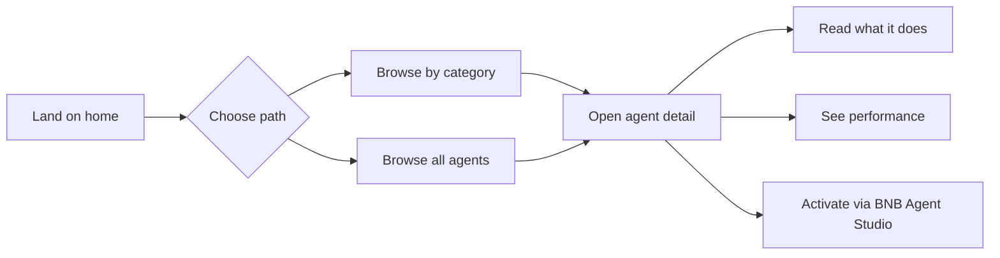

# BNB Agent Marketplace

A clean, simple marketplace for discovering and hiring AI agents on BNB Smart Chain.
Built for the **BNB Chain Build the Era Hackathon** — Main Track.

## What this is

A front end that surfaces agent data, lets users discover and activate agents by category, and doesn't make them think too hard about it.

## Four categories, all first-class

- Rebalancing — manages LP ranges, resets positions automatically
- Grid Trading — places and manages automated grid orders
- Yield Optimization — routes liquidity to the highest available APR
- Health Factor Monitoring — protects lending positions from liquidation

## User journey



1. Land on homepage
2. Pick a category or browse all agents
3. Open an agent to see what it does and how it has performed
4. Activate it through BNB Agent Studio

## Getting started

### Prerequisites

- Node.js 18+
- npm

### Install and run

```bash
npm install
npm run dev
```

Open http://localhost:3000

### Build for production

```bash
npm run build
npm start
```

## Tech stack

- Next.js 16
- React
- Tailwind CSS 4

## Roadmap

- [x] Homepage with category navigation
- [x] Agent listing and detail pages
- [x] Category filtering
- [ ] Real-time agent data from ERC-8004 / 8004scan
- [ ] Live performance charts
- [ ] Direct hire/activate flow via BNB Agent Studio CLI
- [ ] User reviews and ratings
- [ ] Multi-language support

## Hackathon submission

- Live site: https://marketplace-defi.vercel.app
- Repo: https://github.com/Baophan00/bnb-agent-marketplace
- Hackathon: https://www.bnbchain.org/en/hackathons/smart-money-era

## License

MIT
