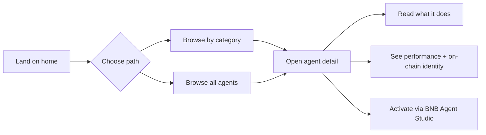
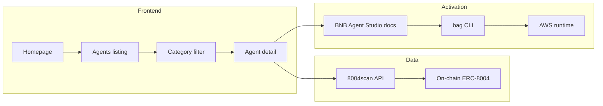

# BNB Agent Marketplace

A clean, simple marketplace for discovering and hiring AI agents on BNB Smart Chain.
Built for the **BNB Chain Build the Era Hackathon** — Main Track.

## Screenshots

- Homepage with 4 categories and featured agents
- `/agents` — browse all live BSC agents from 8004scan
- `/category/<slug>` — filter by category
- `/agents/<id>` — detail page with 8004scan link + activate flow

## What this is

A front end that surfaces agent data, lets users discover and activate agents by category, and doesn't make them think too hard about it.

## User journey



1. Land on homepage
2. Pick a category or browse all agents
3. Open an agent to see what it does and how it has performed
4. Activate it through BNB Agent Studio

## Architecture



- **Data source**: 8004scan public API (`/api/v1/agents?chain=56`)
- **Static export**: Next.js output export on GitHub Pages
- **Runtime**: Vercel / GitHub Pages
- **Agent identity**: ERC-8004 on BSC
- **Activation**: BNB Agent Studio CLI + AWS runtime

## Four categories, all first-class

- Rebalancing — manages LP ranges, resets positions automatically
- Grid Trading — places and manages automated grid orders
- Yield Optimization — routes liquidity to the highest available APR
- Health Factor Monitoring — protects lending positions from liquidation

## Getting started

### Prerequisites

- Node.js 18+
- npm

### Install and run

```bash
npm install
npm run dev
```

Open http://localhost:3000

### Build for production

```bash
npm run build
npm start
```

## Live

- Primary: https://marketplace-defi-5fpng7ywj-modazs-projects.vercel.app
- Backup: https://baophan00.github.io/bnb-agent-marketplace/
- Repo: https://github.com/Baophan00/bnb-agent-marketplace

## Hackathon submission

- Repo: https://github.com/Baophan00/bnb-agent-marketplace
- Live site: https://marketplace-defi-5fpng7ywj-modazs-projects.vercel.app
- Hackathon: https://www.bnbchain.org/en/hackathons/smart-money-era

## License

MIT
